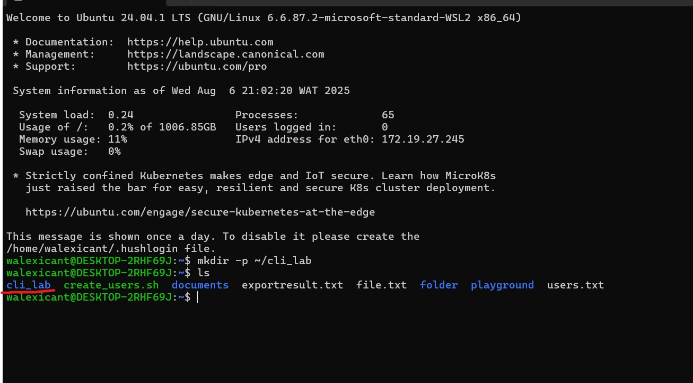
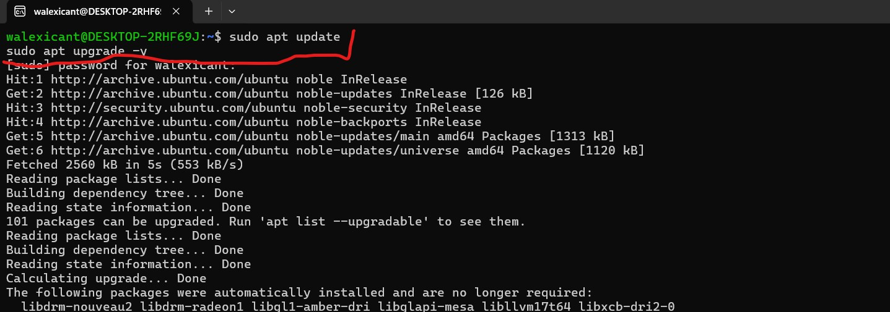

# 🐧 Linux Projects – Shell Scripting Tasks (WSL 2)

This repository contains a series of Linux CLI exercises with supporting scripts and screenshots. Each task was completed using **WSL 2** and documented for learning and portfolio purposes.

---

## 📁 1. Make Directory

Creates a directory named `cli_lab`.

---

## 📄 2. Create Text Files

Creates five `.txt` files: Alpha, Beta, Gamma, Delta, Epsilon.

---

## 🗓️ 3. Add Date to Files

Appends today's date to all `.txt` files in `cli_lab`.

---

## 📋 4. Copy `alpha.txt` to `/tmp`

Copies `alpha.txt` to the `/tmp` directory.

---

## 📁 5. Move `beta.txt` to `archive/`

Moves `beta.txt` to a new `archive` directory inside `cli_lab`.

---

## 🗑️ 6. Remove `epsilon.txt`

Deletes `epsilon.txt`.

---

## 📥 7. Copy `/etc/services` to `cli_lab`

Copies the system file `/etc/services` to `services.txt` in `cli_lab`.

---

## 🔢 8. Count Lines in `services.txt`

Counts the number of lines in `services.txt`.

---

## ❌ 9. Show First 5 Non-Comment Lines

Displays the first 5 non-comment lines from `services.txt`.

---

## 🔎 10. Search for `ssh` (Case-Insensitive)

Finds any lines containing "ssh" (case-insensitive).

---

## 📖 11. Man Page – `less -R`

Explains the `-R` flag for the `less` command, which shows raw ANSI color codes.

---

## 🔄 12. Convert DOS to UNIX Line Endings

Uses `dos2unix` to convert line endings from Windows (CRLF) to UNIX (LF).

---

## 🏗️ 13. `mkdir -p` – Create Parent Directories

Shows how the `-p` flag in `mkdir` creates parent directories as needed.

---

## ⚙️ 14. Update & Upgrade System

Updates the package list and upgrades installed packages.

---

## 📦 15. Install `htop`

Installs the `htop` system monitor.

---

## 🆚 16. Check `htop` Version

Displays the installed version of `htop`.

---

## ❌ 17. Remove `htop` (Keep Configs)

Removes `htop` without deleting config files.

---

## 🔁 18. Reinstall `htop`

Reinstalls `htop` after removal.

---

## ⛔ 19. Hold `htop` Updates

Prevents `htop` from being upgraded automatically.

---

## 🔍 20. Show Held Packages

Lists all packages currently on hold.

---

## 👤 Author

**Olawale Stephen**  
GitHub: [@Walexicant](https://github.com/Walexicant)
